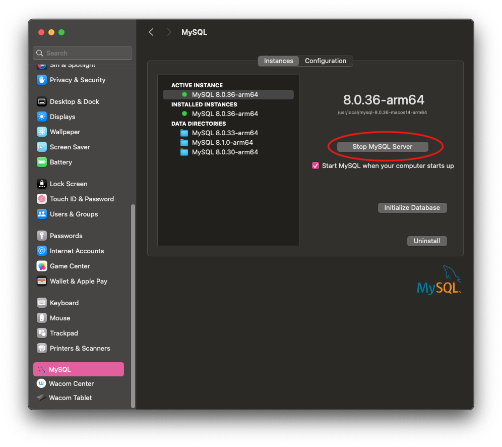
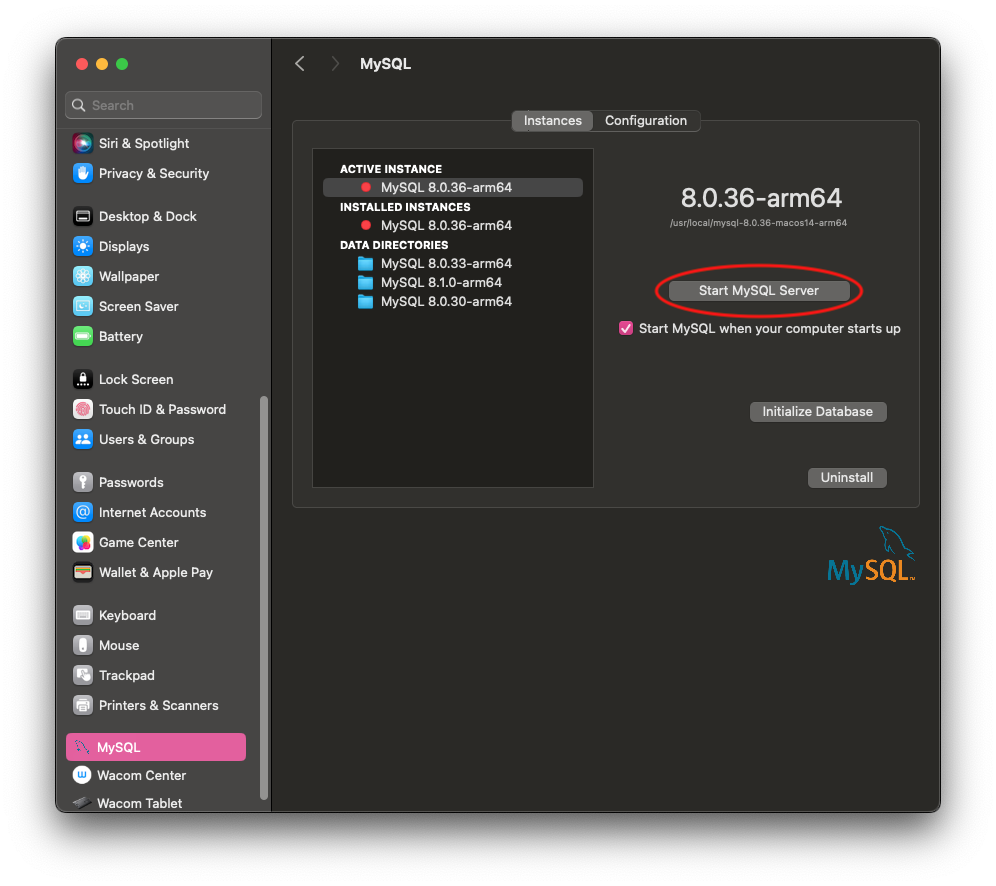

# Change MySQL Password (MacOS)
A guide to changing the root user MySQL password for MacOS users.

## If you know your password:
1. **Access MySQL shell:** Open your terminal and log in to the MySQL shell as the root user. You can do this by typing:
   ```bash
   mysql -u root -p
   ```
   You'll be prompted to enter the current root password. *Note: nothing will appear on the screen as you type your password. This is called "blind typing".*
2. **Change the password:** Once you're logged in, you can change the root password using the `ALTER USER` command. Replace `new_password` with your desired password:
   ```sql
   ALTER USER 'root'@'localhost' IDENTIFIED BY 'new_password';
   ```
   If you're using a different host or username, replace `'root'@'localhost'` with your specific user and host combination.
3. **Flush privileges:** After changing the password, you should flush the privileges to ensure that the changes take effect:
   ```sql
   FLUSH PRIVILEGES;
   ```
4. **Exit MySQL shell:** Once you've completed the steps, you can exit the MySQL shell by typing:
   ```sql
   exit;
   ```
That's it! You've successfully changed the root user password in the MySQL shell.

## If you do NOT know your password:
1. **Stop the MySQL service:** You need to stop the MySQL server to be able to reset the root password. Go to: 'System Settings' > 'MySQL' and click the Stop MySQL Server button.
   
2. **Start MySQL in safe mode:** Start MySQL in safe mode with the `--skip-grant-tables` option. This allows you to connect to the MySQL server without authentication, essentially bypassing the need for a password. 
   ```bash
   sudo mysqld_safe --skip-grant-tables
   ```
3. **Connect to MySQL:** Now, you can connect to MySQL without a password using the following command:
   ```bash
   mysql -u root
   ```
4. **Change the root password:** Once connected to MySQL, you can change the root password using the `ALTER USER` command as mentioned before. Replace `new_password` with your desired password:
   ```sql
   ALTER USER 'root'@'localhost' IDENTIFIED BY 'new_password';
   ```
5. **Flush privileges:** After changing the password, flush the privileges to ensure that the changes take effect:
   ```sql
   FLUSH PRIVILEGES;
   ```
6. **Exit MySQL shell:** Once you've completed the steps, exit the MySQL shell:
   ```sql
   exit;
   ```
7. **Restart MySQL service:** Finally, restart the MySQL server.
   